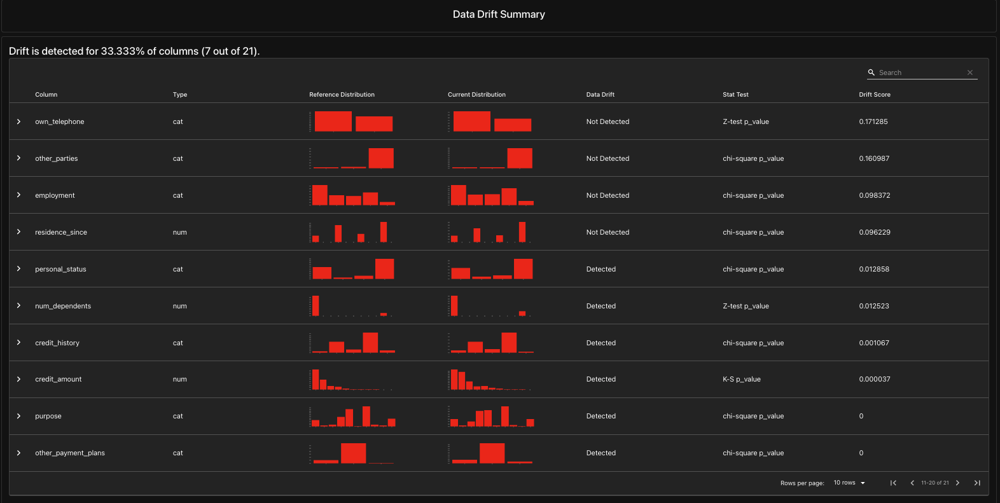
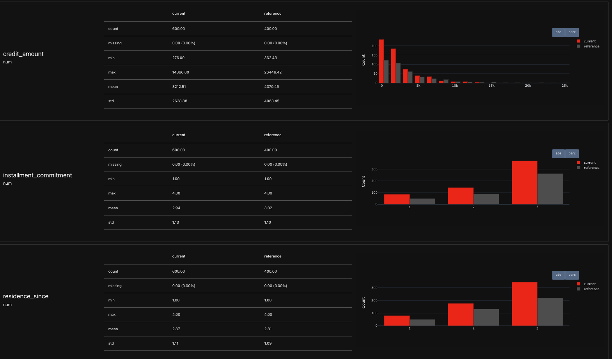

# Evidently AI Drift Detection – Modified Lab

This project is a customized and enhanced version of the original Evidently AI drift analysis lab. I made several meaningful changes to the dataset, preprocessing pipeline, drift simulation strategy, and evaluation setup to deepen my understanding of data drift monitoring and improve the overall demonstration.

## Changes I Made

### 1. Switched to a New Dataset
Instead of using the default Adult Income dataset, I replaced it with:
- The **Credit-G (German Credit Risk)** dataset from OpenML, or
- The **Breast Cancer Wisconsin dataset** as a fallback when SSL errors prevented remote loading.

Choosing a new dataset allowed me to explore drift in a different domain with different statistical characteristics.

### 2. Automated Schema Inference
Instead of hard-coding numerical and categorical columns, I automatically inferred:
- Numerical columns using pandas dtypes
- Categorical columns as all remaining features, ensuring the target variable is included correctly

This made the pipeline more flexible and closer to real-world workflows.

### 3. Created Reference vs Production Splits
I created a realistic split by assigning:
- 60% of the dataset to **reference data**
- 40% to **production data**

This simulates historical vs current data in a monitoring scenario.

### 4. Introduced Synthetic Drift
To ensure that Evidently could detect meaningful drift, I deliberately shifted values in the production dataset. I introduced drift using:
- Additive noise
- Random scaling on selected numerical features
- Controlled deviation large enough to show up in statistical tests

This helped demonstrate how drift affects monitoring results.

### 5. Added Multiple Evidently Reports
Instead of only running the DataDriftPreset, I added:
- `DataSummaryPreset` for overall dataset profiling
- `DataDriftPreset` for feature-by-feature drift evaluation

This produced a more complete and informative report.

### 6. Wrapped Data into Evidently Dataset Objects
I wrapped both reference and production datasets using Evidently’s `Dataset.from_pandas()` method with the inferred schema. This aligns with Evidently’s intended usage for production pipelines.

---

##  What I Learned

###  How dataset choice impacts drift behavior
Different datasets show different types of drift, and selecting a new dataset helped me understand how domain characteristics affect monitoring results.

###  The importance of correct schema definition
Explicit numerical and categorical column definitions are critical for proper statistical analysis in Evidently.

###  How to model reference vs production data
Creating realistic splits taught me how monitoring systems compare historical data with new incoming batches.

###  How to simulate drift effectively
By modifying distributions intentionally, I learned how to test whether drift detection tools work as expected.

###  How Evidently generates and processes reports
I gained hands-on experience with:
- Building definitions
- Passing datasets into Evidently
- Running multiple presets in a single report

##  Final Notes
These changes demonstrate that I went beyond simply running the default example and instead explored real concepts behind data drift, dataset management, and monitoring workflows. This README documents exactly what I changed and what I learned from this exercise.
