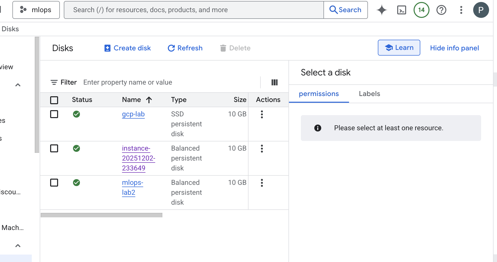
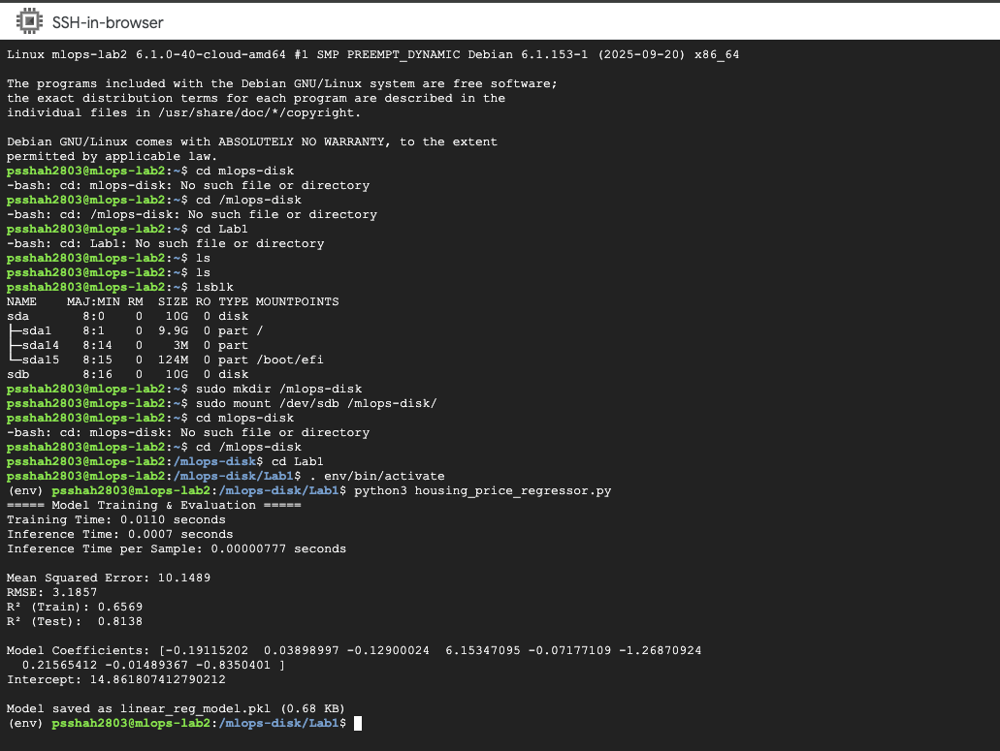
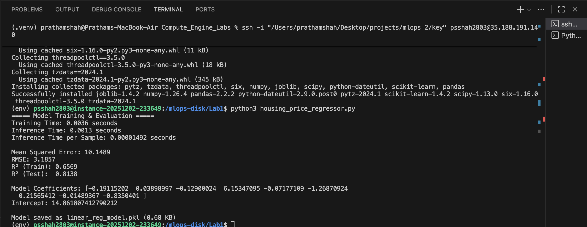

# Google Compute Engine (GCE) 

In this lab, I built a complete machine-learning workflow on Google Compute Engine (GCE), covering infrastructure provisioning, storage management, dataset deployment, model training, and performance benchmarking across VM types.

---

## 1. Provisioned a VM  
.png>)

---

## 2. Provisioned a disk  

---

## 3. Attached and mounted a persistent disk for data and code  

---

## 4. Deployed datasets + scripts to the VM  

---

## 5. Trained multiple ML models and recorded training & inference times

I measured:
- Training time  
- Total inference time  
- Inference time per sample  
- Standard metrics (MSE, RMSE, R²)

---

## 6. Compared performance with a CPU-optimized VM  
**CPU Optimized:**  

**Normal VM:**  

As we can see, the CPU-optimized VM performed significantly better across all timing measurements.

---

## 7. Explored GCE internals  
During the lab, I learned about:

- How GCE handles SSH keys  
- VM-level and project-level metadata  
- Persistent disk attachment and mounting  
- Linux file permissions (`chown`, `chmod`)  
- Why disks cannot be attached to multiple VMs simultaneously  
- Zones and disk locality  
- Using persistent disks for code + dataset storage  

---

# Changes I Made

1. Switched the dataset to the Boston Housing dataset  
2. Changed the model to Linear Regression  
3. Added inference time per sample for better performance comparison  
4. Added extra evaluation metrics for deeper analysis  

---

# Summary

This lab combined system-level cloud engineering (VMs, disks, SSH, Compute Engine) with machine-learning benchmarking.  
It gave me hands-on experience in deploying ML workloads on GCP, optimizing compute performance, and understanding how infrastructure choices affect training and inference speed.
